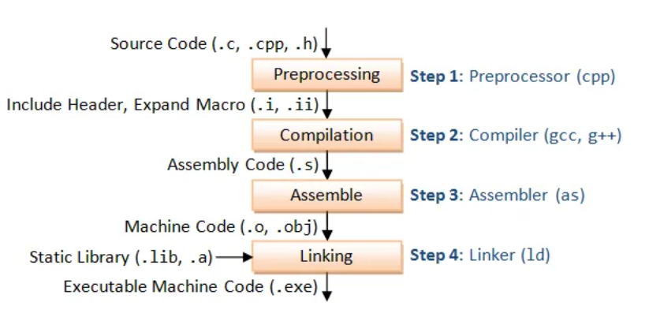

# All about Static Libraries in C
## 10/4/24 ~ 12:53
> https://medium.com/@meghamohan/all-about-static-libraries-in-c-cea57990c495

### What is a library
- Biblioteka je izvrsni program koji se poziva iz drugog programa (pozivalac).
- Program pozivalac biblioteci prosledjuje parametre i poziva funkcije koje su u njoj definisane.

### Static library

- Staticki kompajlirana bilbioteka je izvrsni program koji kombinuje kod programa pozivaoca i same biblioteke.
+ Prednosti staticki kompajliranih biblioteka:
1. Staticki kompajlirane biblioteke nisu potrebne prilikom pokretanja jer su vec unutar izvrsnog programa
2. Prilikom kompajliranja brze je kompajlirati staticke fajlove nego linkovati odredjene izvorne fajlove
- Velicina staticki kompajliranih biblioteka je veca nego kod dinamicki kompajliranih.
- Jos jedna mana ogleda se u tome da ako zelis da izmenis biblioteku moras izmeniti svako mesto, odnosno svaki programski kod koji se koristi.
- Primer staticke biblioteke je: libstatic.a

#### Creating a static library file
- Kreiranje objekt fajlova:
```terminal_session
$ gcc -c static.c
```
- Arhiviranje objektnih fajlova zajedno
```terminal_session
$ ar -cr libstatic.a static.o
```
- *(Opciono)* Indeksiranje kreirane biblioteke radi brzeg referenciranja simbola:
```terminal_session
$ ranlib libstatic.a
```

- Ako zelimo videti simbole u nasoj biblioteci:
```terminal_session
$ nm libstatic.a

static.o:
0000000000000000 T main
                 U puts
```

#### Compiling static library
```terminal
$ gcc static.c -L. -lstatic -o staticlib
```
- -L = navodi se putanja do biblioteke
- -l(ime biblioteke bez prefiksa i ekstenzije)
